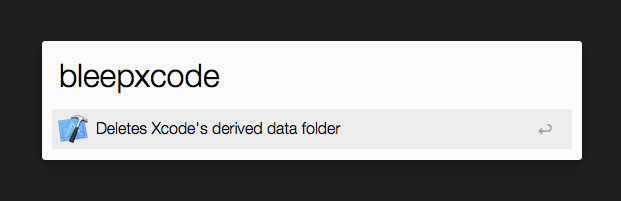

# bleepxcode Alfred workflow

This workflow executes this command to delete Xcode's derived data foloder:
rm -rf ~/Library/Developer/Xcode/DerivedData/

That’s all it does. I use it every day.
If you don't know why this can be useful, it's probably good for you.